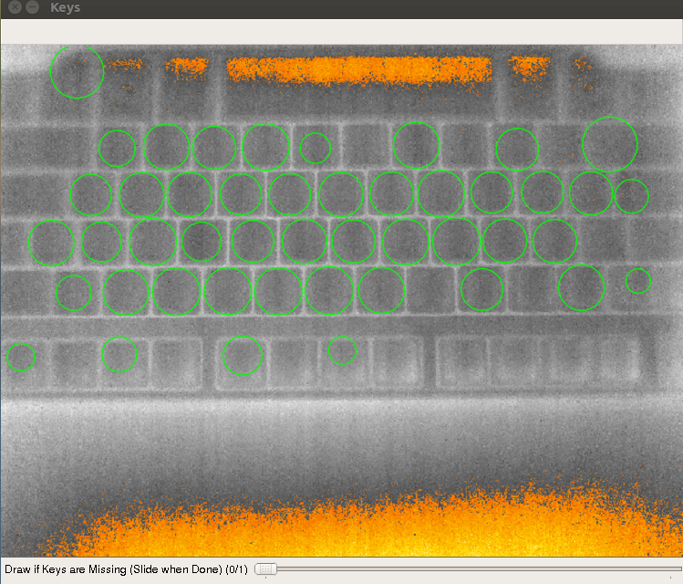
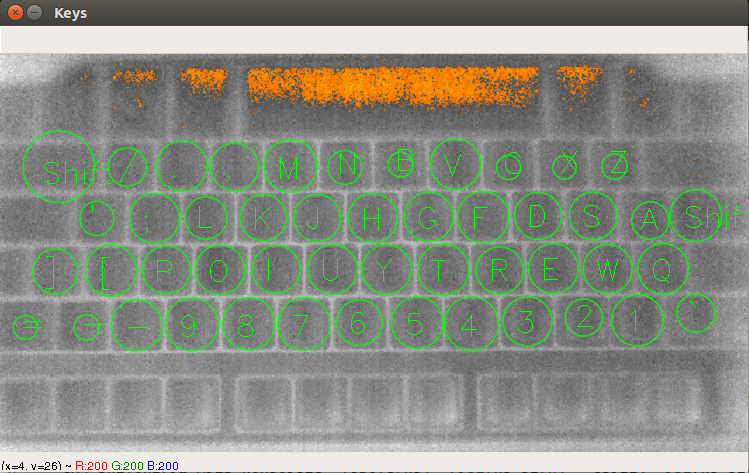
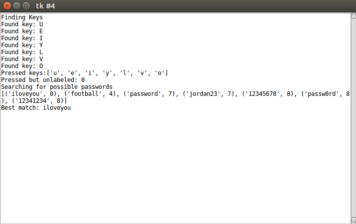

## A Password Extractor Framework for Thermal Images
The password extractor framework uses image processing with `Python` and `OpenCV` to recover passwords given thermal images.
This README outlines how the framework operates and provides information needed to run the framework. 

There are four main steps that have to be taken to find the passwords on a thermal image:
1. Key region detection on the image, 
2. Labeling of keys, 
3. Residue detection,
4. Password recovery and password guessing.

### 1. Key Region Detection
In keyboards, keys are usually separated from each other to prevent unwanted key presses. 
This property creates an observable effect on the thermal image since there are certain temperature differences between a key
and its surroundings. 
We use this property to detect the keys on a given thermal image (i.e., a reference image)
in the first step of the password discovery process. Users also can draw regions that could not be found by the framework.

<figure>
  
  <figcaption>Detected Key Regions on an Image of a Keyboard</figcaption>
</figure>

### 2. Labeling
After the key regions are marked on the image, the user is asked to enter the labels (e.g., characters on a keyboard) for keys. 
The advantage of this approach is that it generalizes the framework to work with 
any types of password/PIN entry devices (e.g., keyboards, PIN pads). 
After labeling is completed, the label data can be saved to be used later.

<figure>
  
  <figcaption>New Key Regions are Added by the User and Labeled</figcaption>
</figure>

### 3. Thermal Residue Detection
After the keys are labeled, a thermal image is chosen by the user and the framework tries to detect thermal residues on the 
image using blob detection. The preprocessing step consists of detecting important regions (e.g., areas above certain temperature) and filtering the other regions out. 
If a blob is in a labeled key region, the corresponding label is used to construct the password.

<figure>
  
  <figcaption>Blobs Found on a Thermal Image</figcaption>
</figure>

### 4. Password Recovery
In the last step, the framework uses a dictionary of passwords to find the "best" match using a distance metric. 
Passwords are sorted according to their distance to the pressed keys found on the thermal image and displayed for further inspection.

<figure>
  
  <figcaption>Progress Information of Password Recovery</figcaption>
</figure>

### Setup
The framework can be run with `Python 2.x` and uses `cv2`, `numpy`, `pickle`, and `tkinter`.

### Run
`blob.py` is the main script. It can be run with the command

`python blob.py SEQ3709/SEQ_3709_58.bmp`

In addition, `utils` folder contains additional helper scripts.
